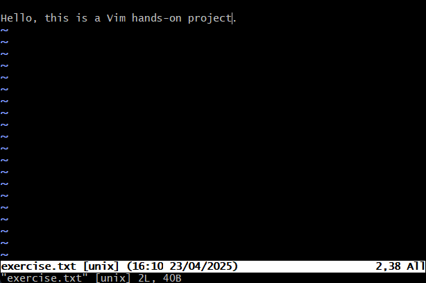
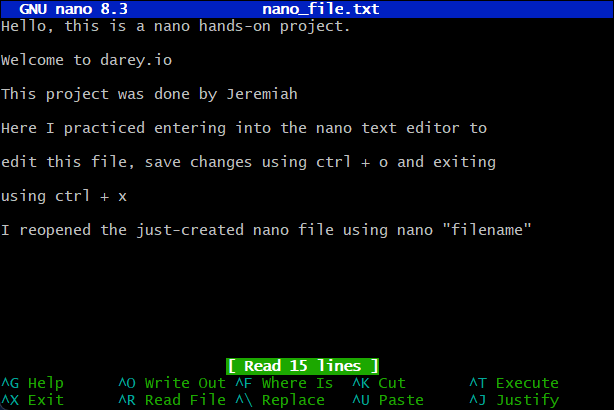

# Linux Text Editors Project

## Overview
This project explores two essential Linux text editors: **Vim** and **Nano**. It demonstrates proficiency in basic text manipulation tasks, including navigation, editing, saving, and file management.

## Introduction to Linux Text Editors
Linux text editors are crucial for managing files directly from the terminal. They provide a way to modify configurations, write code, and handle text-based operations without a graphical interface. 

### **Comparison: Vim vs. Nano**
| Feature      | Vim | Nano |
|-------------|-----|------|
| Learning Curve | Steep | Easy |
| Navigation | Uses `hjkl` keys | Arrow keys |
| Undo Changes | `u` command | Ctrl + _ |
| Modes | Insert, Command, Visual | Single mode |
| Save & Exit | `:wq`, `:q!` | Ctrl + X |

Vim is more powerful and customizable, widely used by developers. Nano is beginner-friendly and straightforward for basic text editing.

---


## Tasks Completed

### **1. Vim Editor**
- Created a new file using:
  ```bash
  vim exercise.txt

- Entered insert mode (i) and typed text.

- Used arrow keys to navigate.

- Used arrow keys to navigate within the text.

- Deleted a single character using x.

- Deleted an entire line using dd.

- Undid changes using u.

### *Saving & Exiting*
- Saved and exited using:
  ```bash
  :wq

- Exited without saving using:
  ```bash
  :q!

### **2. Nano Editor**
- Created a file using:
  ```bash
  nano nano_file.txt

- Edited text directly in Nano.

- Navigated using arrow keys on my keyboard.

- Saving & Exiting
  - Saved using:
    ```bash
    Ctrl + O
  - Exited using:
    ```bash
    Ctrl + X

  - Reopened the file using:
    ```bash
    nano nano_file.txt


### **Screenshots**
   Screenshots provided for confirmation of all actions


#

#

#


## **Challenges & Solutions**
1.  Issue: Difficulty quitting Vim without saving.
 
    Solution: Used :q! to force quit.

2. Issue: Confusion with Vim navigation keys (hjkl).

   Solution: Practiced movement commands.

3.  Issue: Unintended deletions in Nano.

    Solution: Used Ctrl + _ for undo.

### **Conclusion**
This project successfully fulfills all instructor-defined objectives, demonstrating practical usage of both Vim and Nano for text manipulation in a Linux environment.